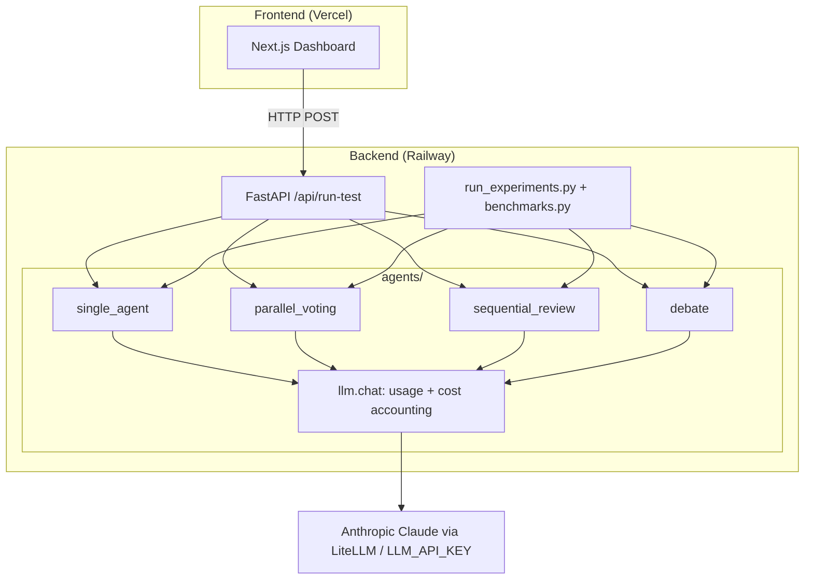
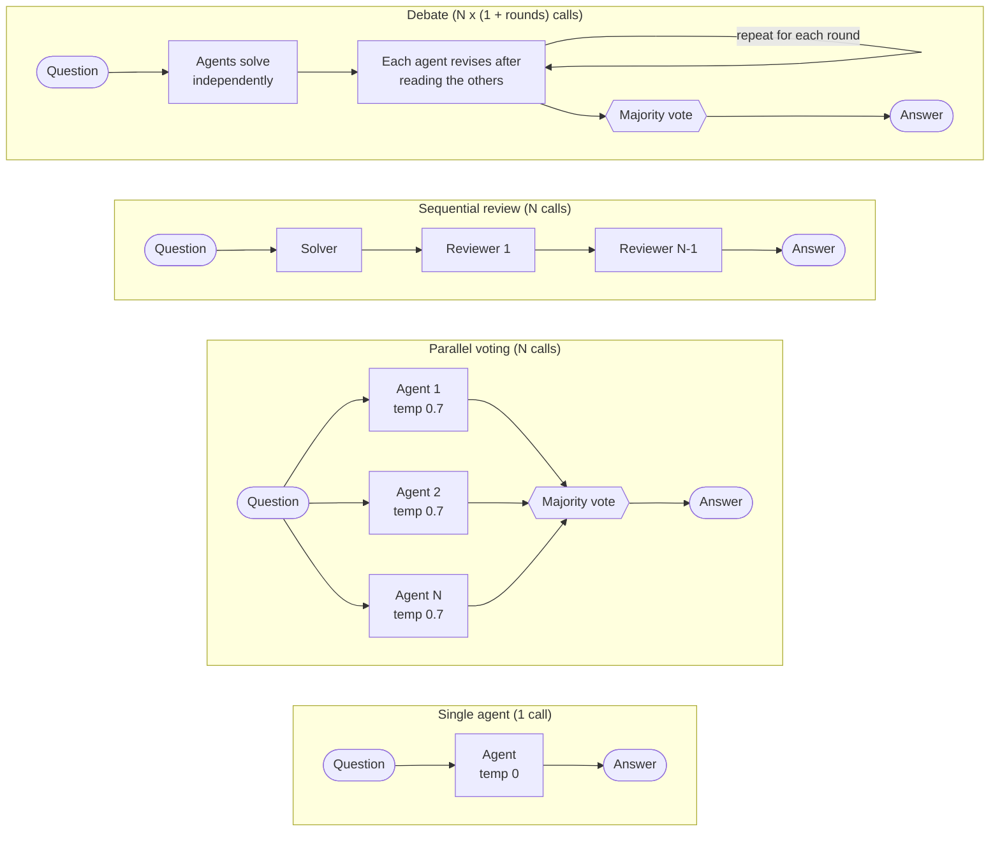
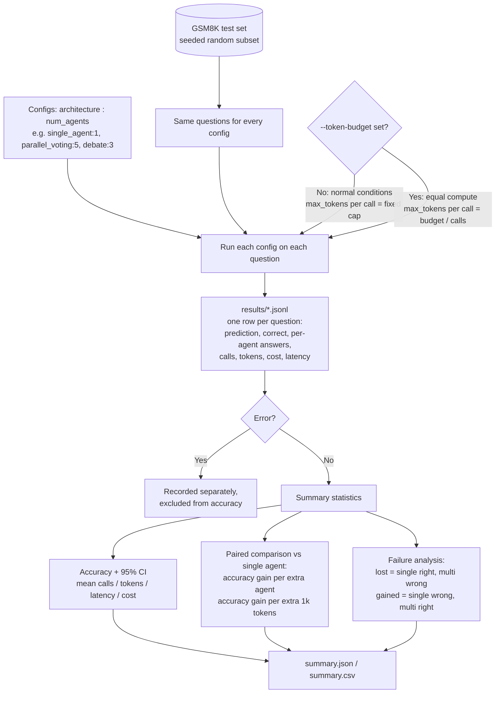
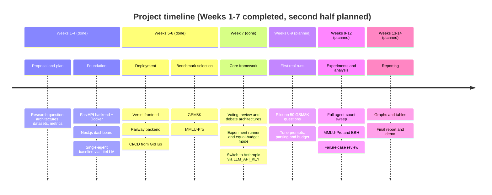

# Midterm Project Report: Weeks 1–7

**Project:** Single-Agent vs. Multi-Agent LLM Systems: Evaluating Agentic Architectures for Reasoning Performance and Computational Efficiency
**Repository:** https://github.com/miyannishar/agent-architecture-research

---

## 1. Project Overview

**Problem.** LLMs are increasingly used in agentic systems where several agents solve a problem together, by voting, reviewing each other's work or debating. These architectures are widely expected to improve reasoning, but they also cost more model calls, tokens, latency and money. A multi-agent system can look better simply because it spends more total compute than a single agent.

**Research question.** *Under comparable computational budgets, when do multi-agent LLM systems outperform single-agent systems, and when does adding more agents lead to diminishing or negative returns?*

**Related questions.**
- Does accuracy improve consistently as agents are added?
- Which architectures work best?
- Do harder tasks benefit more than easy ones?
- How much extra cost, latency and token usage buys each gain in accuracy?
- Can collaboration make a correct answer wrong?

**Goals and objectives.**
1. Build a controlled experimental framework: same model, prompts, questions and grading for every architecture.
2. Implement a single-agent baseline and several multi-agent architectures (parallel voting, sequential review, debate; coordinator-worker if time permits), with 1, 2, 3 and 5 agents.
3. Evaluate on established benchmarks (GSM8K, MMLU-Pro, BIG-Bench Hard) under two conditions: normal, and equal compute budget.
4. Measure accuracy, total tokens, number of model calls, latency, estimated cost, and accuracy gain per added agent and per added token.
5. Analyze failure cases where adding agents turned a correct answer into a wrong one.

**Expected final outcome.** An experimental framework, implemented architectures, benchmark scripts, collected results, comparison graphs, and a final research report on which architectures justify their extra cost.

---

## 2. Work Completed: Weeks 1–7

### Weeks 1–4: Research definition and foundation (Milestone 1)
- **Research proposal and detailed plan.** Wrote the proposal and the detailed plan (`docs/a1.pdf`, `docs/a2.pdf`). They define the research question, the architectures to compare, the datasets, the two experiment types (normal vs. equal budget), the metrics and the deliverables.
- **System architecture design.** Chose a decoupled, two-service design instead of a monolith. A Next.js dashboard handles only user interaction and display. A FastAPI backend handles all agent orchestration. New agent topologies require only a new API parameter, not frontend changes.
- **Backend** (Python, FastAPI, Docker).
  - Built the `/api/run-test` endpoint, which accepts an architecture name and a prompt and returns the answer plus latency, token usage and cost.
  - Containerized it with a `Dockerfile` and `docker-compose.yml`.
  - Added request-lifecycle logging.
- **Execution engine.** Integrated LiteLLM so one call interface can route to different providers. Implemented the single-agent baseline against OpenAI `gpt-3.5-turbo`.
- **Frontend** (Next.js, React, Tailwind CSS). Built a dashboard where the user selects an architecture, enters a task, and sees latency, tokens, cost and the final output. Added structured error display for backend and network failures.
- **Fallbacks.** Added mock responses so the UI works with no API key, and stubs for the multi-agent architectures.

### Weeks 5–6: Deployment and benchmark selection
- **Cloud deployment.** Deployed the frontend to **Vercel** and the backend (from the Docker configuration) to **Railway**. Both are connected to GitHub, so every push auto-deploys. The frontend finds the backend through the `NEXT_PUBLIC_BACKEND_URL` environment variable.
- **Benchmark research.** Compared reasoning benchmarks on whether they expose hallucinations and measure reasoning depth. Selected **GSM8K** (math word problems with exact numeric answers, so grading is objective) and **MMLU-Pro** (multidisciplinary reasoning). BBH remains a candidate.

### Week 7: Core experiment infrastructure and provider switch
- **Provider switch to Anthropic.** Moved from OpenAI to Anthropic Claude for better reasoning performance. The key is now the provider-neutral `LLM_API_KEY`, and the default model is `anthropic/claude-haiku-4-5-20251001` through LiteLLM (override with `LLM_MODEL`). Cost is now computed from separate input and output tokens at configurable prices, replacing a flat per-token estimate. Updated `.env.example` and `docker-compose.yml`.
- **Four architectures implemented** (`backend/agents/architectures.py`). All share the same model, prompt style and `Final answer:` output format, so differences come from the architecture alone.
  - *Single agent*: one call at temperature 0 (baseline).
  - *Parallel voting*: N independent agents at temperature 0.7, majority vote on the extracted answer.
  - *Sequential review*: one solver, then N−1 reviewers told to fix errors but keep correct answers.
  - *Debate*: N agents solve independently, revise after reading the others' solutions, then majority vote.
  - The agent count is a parameter, which supports the 1/2/3/5 sweep.
- **Compute accounting.** Each task reports model calls, input and output tokens, and cost summed across all agents.
- **Automated benchmark pipeline** (`backend/benchmarks.py`, `backend/run_experiments.py`).
  - Loads a seeded random subset of GSM8K so every architecture gets the same questions.
  - Runs every architecture/agent-count config and logs one JSON record per question.
  - Reports accuracy with a 95% confidence interval, mean calls, tokens, latency and cost.
  - Reports accuracy gain over baseline per extra agent and per extra 1k tokens.
  - Counts "lost" questions (single agent right, multi-agent wrong) and "gained" ones, for failure analysis.
  - `--token-budget` runs the equal-compute experiment by splitting a fixed per-task token budget across an architecture's calls.
- **Reliability fix.** LLM failures used to be returned as a normal response containing an error string, which would have been graded as a wrong answer in benchmarks. They now surface as HTTP 500, and the runner records errors separately and excludes them from accuracy.
- **Dashboard update.** Added the debate option, an agent-count selector, and display of model calls and the final answer. Fixed existing lint errors.

**Tools and technologies:** Python 3.11, FastAPI, Pydantic, LiteLLM, Anthropic Claude (Haiku 4.5), Docker; Next.js 16, React 19, TypeScript, Tailwind CSS 4; Vercel, Railway, GitHub; GSM8K dataset.

---

## 3. Evidence of Progress

**GitHub repository:** https://github.com/miyannishar/agent-architecture-research

**Commit history** (Weeks 1–6 work; Week 7 work is in the working tree and will be committed after review):

| Commit | Date | Description |
|---|---|---|
| `5b5b1bd` | 2026-09-14 | Initial commit: Milestone 1 (FastAPI backend, Next.js dashboard, LiteLLM baseline) |
| `5569424` | 2026-09-29 | Docker setup |
| `6b0f6f5` | 2026-09-29 | Deployment configuration |
| `5102720` | 2026-09-29 | Enhanced backend logging and frontend error handling |

**System design** (`docs/progress_report_1.md`, updated for Week 7):




**The four architectures** (all use the same model and the same `Final answer:` format; `N` is the number of agents):



**Experiment pipeline** (`backend/run_experiments.py`):



**Code excerpts.**

Single LLM entry point with per-call cost accounting (`backend/agents/llm.py`):

```python
in_tok = getattr(u, "prompt_tokens", 0) or 0
out_tok = getattr(u, "completion_tokens", 0) or 0
in_price, out_price = _price_per_token()
usage = Usage(calls=1, input_tokens=in_tok, output_tokens=out_tok,
              cost=in_tok * in_price + out_tok * out_price)
```

Parallel voting (`backend/agents/architectures.py`):

```python
with ThreadPoolExecutor(max_workers=num_agents) as pool:
    results = list(pool.map(lambda _i: chat(SOLVE_SYSTEM, prompt, temperature=0.7, max_tokens=max_tokens),
                            range(num_agents)))
...
winner = _majority(answers)
```

Equal-compute mode (`backend/run_experiments.py`):

```python
calls = calls_per_task(arch, n_agents, args.rounds)
max_tokens = max(64, args.token_budget // calls) if args.token_budget else args.max_tokens
```

**Running the experiments** (from `backend/`, with `LLM_API_KEY` set):

```
python run_experiments.py --n 50                                  # normal conditions
python run_experiments.py --n 50 --token-budget 3000              # equal compute budget
python run_experiments.py --n 50 --configs single_agent:1 parallel_voting:3 parallel_voting:5 debate:3
```

**Testing results.**
- Architecture logic was tested with a stubbed model:
  - Voting picks the majority answer, for example `['42','7','42'] -> 42`.
  - Call counts match the formula (debate with 3 agents makes 6 calls).
  - `1,200.0`, `$18` and `(b)` normalize correctly.
  - The GSM8K loader returned correctly parsed answers.
- The API endpoint returned the new fields, and an unknown architecture returned HTTP 400.
- The experiment runner's summary statistics (accuracy, confidence interval, paired gain, lost/gained counts, per-call token cap in budget mode) produced correct output on synthetic data.
- `npm run lint` passes on the frontend.
- **These are correctness checks of the code, not experimental results.** They used a stubbed model and are not reported as findings.

**Experimental results.** None collected yet. Real benchmark runs are the first task after the midterm.

**Screenshots (to insert before submission).**
- [ ] Dashboard with an architecture selected and a result displayed
- [ ] Vercel and Railway deployment pages
- [ ] Terminal output of `run_experiments.py` summary table

---

## 4. Progress Compared with the Original Proposal

The proposal defines scope and deliverables rather than week-by-week dates, so the status below is against its scope.

**Project timeline** (completed vs. planned):



| Proposal item | Status |
|---|---|
| Single-agent baseline | **Completed** |
| Parallel voting | **Implemented** (Week 7); awaiting real-model runs |
| Sequential review | **Implemented** (Week 7); awaiting real-model runs |
| Multi-agent debate | **Implemented** (Week 7); awaiting real-model runs |
| Coordinator-worker | Not started (marked "if time permits" in the proposal) |
| Vary agent count (1/2/3/5) | **Supported** by the pipeline; sweep not yet run |
| GSM8K | **Loader and grading completed**; not yet run |
| MMLU-Pro, BBH | Selected; loaders **in progress** (next) |
| Normal and equal-budget experiments | **Pipeline completed**; experiments not yet run |
| Metrics (accuracy, tokens, calls, latency, cost, gain per agent/token) | **Implemented** |
| Failure-case analysis | Metric implemented; case review pending |
| Graphs and final report | Pending |
| Public deployment | **Completed** (not in the original proposal) |

**On schedule?** Infrastructure, deployment and all core architectures are complete at the midpoint. Data collection and analysis have not started, so the remaining schedule is tight but achievable if the first real runs happen right after the midterm.

**Changes to the original plan.**
1. **Google ADK replaced by direct LiteLLM calls.** ADK failed at runtime and needs heavy session and runner scaffolding that is unrelated to the research. LiteLLM gives the same reasoning behavior with exact token and cost tracking. The code is still a controlled framework as the proposal intends, but it does not use ADK.
2. **OpenAI replaced by Anthropic Claude** (`LLM_API_KEY`) for better reasoning performance.
3. **Added** a public cloud deployment and an interactive dashboard, which the proposal did not require.

---

## 5. Challenges and Solutions

| Challenge | Impact | Solution | Status |
|---|---|---|---|
| **Google ADK runtime error** (`BaseNode.run() takes 1 positional argument but 2 were given`); ADK needs `SessionService` and `InMemoryRunner` boilerplate | Blocked the single-agent baseline in Milestone 1 | Switched to direct `litellm.completion` calls | Resolved |
| **Frontend on Vercel calling `localhost`, plus production API keys** (CORS and environment variables) | Deployed UI could not reach the backend | Configured `NEXT_PUBLIC_BACKEND_URL` on Vercel and injected keys in Railway | Resolved. The backend still allows all origins (`*`); restricting to the Vercel domain is open |
| **Errors hidden as results**: failed LLM calls returned a normal response with an error string and 0 tokens | Would silently count as wrong answers and bias benchmark accuracy | Failures now raise HTTP 500; the runner records errors separately and excludes them from accuracy | Resolved |
| **Fair comparison**: multi-agent systems may win only by using more compute | Could invalidate the main conclusion | Built equal-token-budget mode, and measure accuracy gain per extra agent and per extra token | Resolved in code. The budget level still needs tuning so a single agent is not truncated |
| **Answer parsing** for voting and grading depends on the model ending with `Final answer: …` | Missing format means no answer, which can bias results | Standard prompt format and normalization; the rate of missing answers will be tracked in results | Open, to be measured in real runs |
| **Provider switch** (OpenAI to Anthropic) | Env vars, cost model and deployment settings all referenced OpenAI | Renamed to `LLM_API_KEY`, made model and prices configurable | Resolved in code. Railway needs the new variable set |

---

## 6. Current Project Status

**Achieved at the midpoint:**
- A live, deployed, decoupled platform (Vercel frontend, Railway backend) with CI/CD.
- The experimental framework: four agent architectures with a configurable number of agents, shared prompts and grading, and full compute accounting (calls, tokens, cost, latency).
- An automated GSM8K benchmark pipeline with confidence intervals, paired comparison against the single-agent baseline, per-agent and per-token gain metrics, failure-case counts, and an equal-compute mode.
- A provider migration to Anthropic Claude through a single `LLM_API_KEY`.

**Incomplete:**
- No real experiments have been run, so there are no accuracy results yet.
- MMLU-Pro and BBH loaders, and the breakdown by task difficulty.
- Failure-case review, graphs, and the final report.
- Optional coordinator-worker architecture and CORS restriction.

---

## 7. Plan for the Second Half of the Semester

| Phase | Tasks |
|---|---|
| **Weeks 8–9: First real runs** | Set `LLM_API_KEY` on Railway. Run a ~50-question GSM8K pilot to estimate cost and check answer-format compliance. Fix prompt or parsing issues. Choose the equal-budget level. |
| **Weeks 9–11: Main experiments** | Run the full GSM8K sweep (single agent, and 2, 3 and 5 agents for each multi-agent architecture) under normal and equal-budget conditions. Add MMLU-Pro and BBH loaders and run them. |
| **Weeks 11–12: Analysis** | Break results down by task difficulty. Review "lost" cases (correct single-agent answer turned wrong): agents reinforcing a wrong majority, or changing a correct answer. Compute accuracy gain per added agent and per added token. |
| **Weeks 13–14: Reporting** | Produce tables and graphs (accuracy vs. cost, tokens, latency and number of agents). Optionally add the coordinator-worker architecture and restrict CORS. Write the final research report. |
| **Final week** | Final report, demo and presentation. |

Milestones: (1) first real GSM8K results; (2) normal vs. equal-budget comparison complete; (3) second and third benchmarks done; (4) final report with graphs.

---

## Appendix: Midterm Video Outline (3–5 min)

1. **(0:00–0:30) Introduce:** the research question and why compute-matched comparison matters.
2. **(0:30–1:30) Work completed:** architecture diagram, the four architectures, the Anthropic switch.
3. **(1:30–3:15) Live demo:** open the deployed dashboard, run single agent vs. parallel voting on the same GSM8K-style question and compare calls, tokens, cost and latency. Then run `python run_experiments.py --n 5` and show the summary table.
4. **(3:15–4:00) Results and status:** what is verified, honestly state that full experiments are next.
5. **(4:00–4:45) Second half:** the plan and milestones above.
