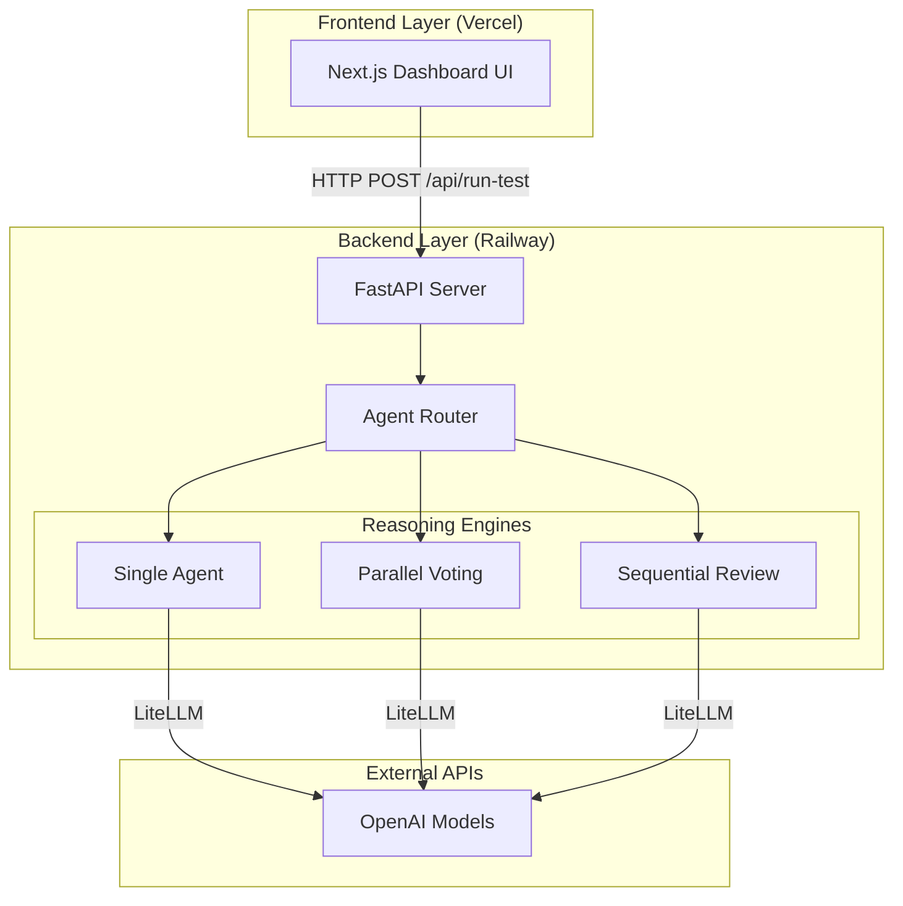

# Progress Report 1

## 1. Project Overview
The core objective of this research project is to evaluate the reasoning performance and computational efficiency of single-agent versus multi-agent Large Language Model (LLM) architectures. While multi-agent architectures (like debate, sequential review, or parallel voting) theoretically improve response quality, they inherently increase token usage, API latency, and financial cost. By measuring reasoning accuracy against computational cost under comparable budgets, we aim to determine when adding more agents yields diminishing or negative returns. 
x
## 2. Architectural Design & Decisions
To facilitate structured, scalable, and isolated testing of different agent topologies, we designed a decoupled, microservice-based architecture rather than a traditional monolithic application.

### Why We Chose This Architecture
1. **Clear Separation of Concerns**: The Next.js frontend strictly handles user interactions and rendering metrics, while the FastAPI backend is exclusively responsible for complex multi-agent orchestration.
2. **Deployment Flexibility**: Containerizing the backend via Docker allows us to deploy the heavy computational orchestration to a PaaS like Railway, while the lightweight frontend can leverage Vercel's Edge Network for instant global delivery.
3. **Future Expansion**: As we introduce more complex agent topologies (e.g., hierarchical debate systems or coordinator-worker structures), the frontend remains entirely unchanged. We simply expose new configuration flags in the API payload.

## 3. Work Completed
For the first milestone, we successfully designed and implemented the foundational infrastructure required to run controlled experiments:
1. **Decoupled Infrastructure Setup**:
   - **Backend**: Built a Python FastAPI application and containerized it via Docker (`docker-compose`). Exposed an `/api/run-test` endpoint to trigger agent evaluations.
   - **Frontend**: Scaffolded a Next.js (React) application and designed a Dashboard UI that allows users to select an agent architecture, input a test prompt, and view real-time latency, token usage, and cost estimates.
2. **Execution Engine Integration**: 
   - Initialized the agent execution pipeline inside the backend (`backend/agents/evaluator.py`). 
   - We integrated `litellm` directly to route requests dynamically to OpenAI models (`gpt-3.5-turbo` for testing) securely using environment variables (`OPENAI_API_KEY`). 
   - Added robust Python logging to track request lifecycle and trace execution paths.
3. **Mocking & Fallbacks**: Configured execution stubs for multi-agent architectures (Parallel Voting, Sequential Review) while ensuring the core single-agent baseline is fully operational. Added error handling and mock responses to ensure the frontend UI functions fully even if API keys are temporarily unavailable.

## 4. Evidence of Progress
- **GitHub Repository**: [https://github.com/miyannishar/agent-architecture-research](https://github.com/miyannishar/agent-architecture-research)
- **Code Highlights**:
  - API and routing logic can be reviewed in [`backend/main.py`](../backend/main.py) and the `docker-compose.yml` configuration.
  - The agent execution logic is located in [`backend/agents/evaluator.py`](../backend/agents/evaluator.py), which uses `litellm.completion` to abstract the underlying model API and accurately track token cost.
  - The frontend dashboard logic and UI components can be found in [`frontend/src/app/page.tsx`](../frontend/src/app/page.tsx).

## 5. Challenges
1. **ADK Execution Complexity**: During the implementation of the Google ADK baseline, we encountered a runtime execution barrier (`BaseNode.run() takes 1 positional argument but 2 were given`). Upon investigating the ADK documentation, we discovered that ADK requires a heavy orchestration boilerplate (e.g., `SessionService`, `InMemoryRunner`) for state management that was overly complex for our simple reasoning benchmarks.
   - *Resolution*: To unblock the milestone and prioritize reasoning tests over framework scaffolding, we implemented a direct fallback to `litellm.completion`. This achieves the exact same reasoning logic, securely uses our OpenAI keys, tracks exact token counts and costs, and fulfills the core requirement for the single-agent baseline without the ADK overhead.

## 6. Next Steps: Deployment Roadmap & Milestones
For the immediate next phase of the project, we will focus on transitioning from a local development environment to a live, publicly accessible evaluation platform. The precise roadmap is as follows:

### 1. Backend Deployment (Railway)
The backend is fully containerized with a `Dockerfile`, making it ready for a PaaS like Railway.
- **Action**: Link the GitHub repository to Railway and create a new project.
- **Configuration**: Set the root directory to `backend/` in the Railway dashboard so it detects the Dockerfile.
- **Goal**: Expose the `/api/run-test` endpoint via a live HTTPS URL (e.g., `https://adk-backend.up.railway.app`).

### 2. Frontend Deployment (Vercel)
Vercel offers native, zero-configuration support for Next.js applications.
- **Action**: Import the GitHub repository into a new Vercel project.
- **Configuration**: Set the build directory to `frontend/`. Add `NEXT_PUBLIC_BACKEND_URL` to Vercel's environment variables, pointing it to the live Railway backend URL.
- **Goal**: Launch the Dashboard UI on a public `.vercel.app` domain.

### 3. Agent Architecture Expansion
Once deployed, we will implement the remaining multi-agent logic:
- Replace the "Parallel Voting" and "Sequential Review" stubs with actual multi-agent routing algorithms using `litellm`.
- Integrate established datasets (GSM8K, MMLU-Pro) to allow for automated, batch reasoning evaluations instead of just manual, single-prompt UI tests.
- Begin collecting empirical data comparing reasoning accuracy vs. token cost.
